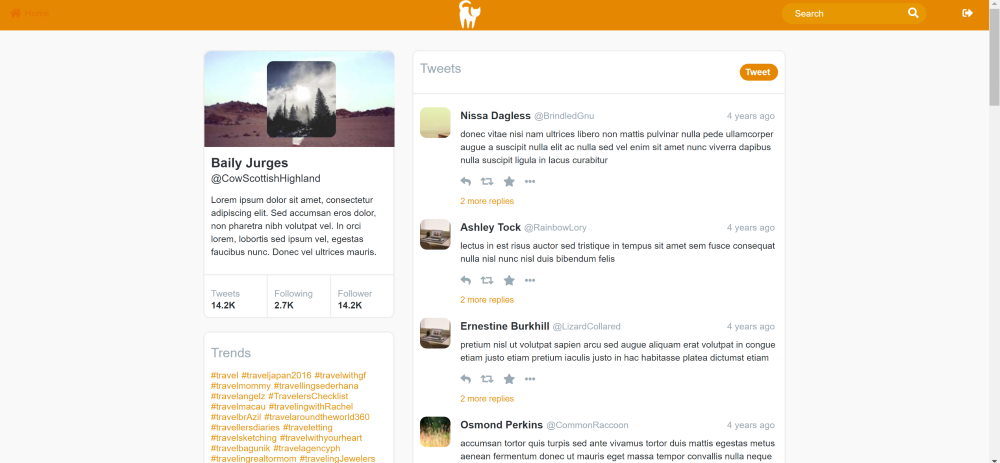

# Clutter

## Refactored with Nx/Angular
- https://github.com/artbrock/clutter
- https://github.com/mcknasty/twitter-angular-clone.github.io

## Preview

- Angular Webapp



- Ionic Mobileapp


## Project Management w/ Acorn

We use Sprillow's Holochain app [Acorn](https://github.com/lightningrodlabs/acorn) v1.0.2-alpha ([download](https://github.com/lightningrodlabs/acorn/releases/tag/v1.0.2-alpha)) for project management. If you wish to join us there, please [download the app](https://github.com/lightningrodlabs/acorn/releases/tag/v1.0.2-alpha), install it, click "Join a project" and paste in this secret: `blunt budding gatherer spilt simply`.

## Environment Setup

1. Install the holochain dev environment (only nix-shell is required): https://developer.holochain.org/docs/install/
2. Enable Holochain cachix with:

```bash
nix-env -iA cachix -f https://cachix.org/api/v1/install
cachix use holochain-ci
```

3. Clone this repo and `cd` inside of it.
4. Enter the nix shell by running this in the root folder of the repository: 

```bash
nix-shell
npm install
```

This will install all the needed dependencies in your local environment, including `holochain`, `hc` and `npm`.

## Building the DNA

- Build the DNA (assumes you are still in the nix shell for correct rust/cargo versions from step above):

```bash
npm run build:happ
```

## Running the DNA tests

```bash
npm run test
```

## Develop the UI

To run the Happ (Holochain + web UI + mobile UI):

``` bash
npm run start (from first terminal)
npm run web (from second terminal)
npm run mobile (from third terminal)
```

To run another agent, open another terminal(s), and execute again:

```bash
npm run start (fourth terminal)
npm run web (fifth terminal)
npm run mobile (from sixth terminal)
```

Each new agent that you create this way will get assigned its own port and get connected to the other agents.
- TODO: pass port in Angular app

## Package

To package the web happ:

``` bash
npm run package
```

You'll have the `clutter.webhapp` in `workdir`. This is what you should distribute so that the Holochain Launcher can install it.

You will also have its subcomponent `clutter.happ` in the same folder`.

## Documentation

We are using this tooling:

- [NPM Workspaces](https://docs.npmjs.com/cli/v7/using-npm/workspaces/): npm v7's built-in monorepo capabilities.
- [hc](https://github.com/holochain/holochain/tree/develop/crates/hc): Holochain CLI to easily manage Holochain development instances.
- [@holochain/tryorama](https://www.npmjs.com/package/@holochain/tryorama): test framework.
- [@holochain/conductor-api](https://www.npmjs.com/package/@holochain/conductor-api): client library to connect to Holochain from the UI.

## Nx

```bash
npm install --save-dev @nrwl/angular
npx nx generate @nrwl/angular:application clutter-web --no-interactive
npm install --save-dev --exact @nxtend/ionic-angular --legacy-peer-deps
npm install --save-dev --exact @nxtend/capacitor --legacy-peer-deps
npx nx generate @nxtend/ionic-angular:application clutter-mobile --capacitor false
npx nx generate @nrwl/angular:library clutter/data-access-dna
npx nx generate @nrwl/angular:library shared/util-holochain
npx nx generate @nrwl/angular:library shared/util-common
```